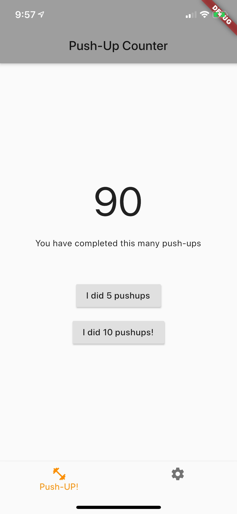
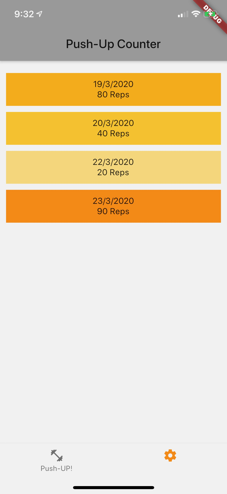

# Push-up Counter

A very simple mobile app to count push-ups on a daily basis.

The very basic implemented functionality:

- Increment by 5 or 10
- See the previous week of push-ups:
    - (It stores them all, just only displays the last 7 days)

## Technology

This app is built using Dart and [Flutter](https://flutter.dev/), and SQLite for data persistence.

## Screenshots

 

## Future goals

- Configuration options:
    - Set a daily goal
    - Upload a set of daily goals that could fluctuate (thinking the [_Push-up Challenge_](https://www.thepushupchallenge.com.au/))

- Local notification that tells you how many left for the day as motiviation.

- Better historical view:
    - With graphs, everyone likes graphs.

- Better support for timezones
    - Dates are stored as instances in time,
    - Currently it'll show the push-ups as if they were in your local timezone

- Categorise different _types_ of push-ups, eg:
    - Traditional,
    - Wide grip,
    - Diamond,
    - and maybe suggest what you should do to be more well-rounded.

## Getting Started

This project is a starting point for a Flutter application.

A few resources to get you started if this is your first Flutter project:

- [Lab: Write your first Flutter app](https://flutter.dev/docs/get-started/codelab)
- [Cookbook: Useful Flutter samples](https://flutter.dev/docs/cookbook)

For help getting started with Flutter, view our
[online documentation](https://flutter.dev/docs), which offers tutorials,
samples, guidance on mobile development, and a full API reference.
